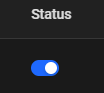
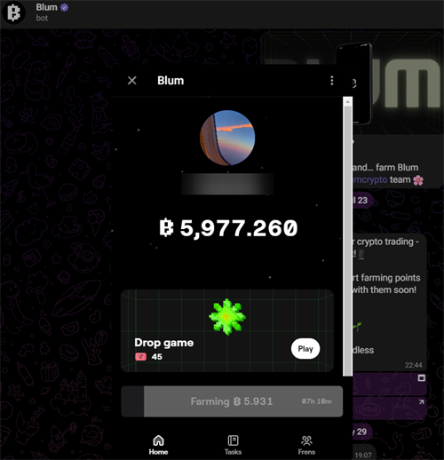

> [!NOTE]
> - Contacts: [Telegram](https://t.me/mudachyo)
> - Channel: [Telegram Channel](https://t.me/shopalenka) 
> - 🇷🇺 README на русском доступен [здесь](README.md)
---
## How to run  
- Install the extension in your browser [Requestly](https://chromewebstore.google.com/detail/requestly-intercept-modif/mdnleldcmiljblolnjhpnblkcekpdkpa)
- Open https://app.requestly.io/rules#sharedList/1718108026311-Blum-web
- Click _Import to my rules_ on the top right.  
- Turn on the Status switch 
- Open [Bot Blum](https://web.telegram.org/k/#?tgaddr=tg%3A%2F%2Fresolve%3Fdomain%3DBlumCryptoBot%26appname%3Dapp%26startapp%3Dref_jcGkWMkJaN) and run the game

## Auto Clicker
- Automatically clicks on in-game items such as flowers, bombs and freezes, has a pause/resume button, and displays your stats after each game.
- Open https://app.requestly.io/rules#sharedList/1717982966552-Blum-Autoclicker
- Click _Import to my rules_ on the top right. and turn on the Status switch 
- Open [Bot Blum](https://web.telegram.org/k/#?tgaddr=tg%3A%2F%2Fresolve%3Fdomain%3DBlumCryptoBot%26appname%3Dapp%26startapp%3Dref_jcGkWMkJaN) and run the game

# [Watch the video on YouTube](https://www.youtube.com/watch?v=de_tcx66VgQ)

## 
---
> [!TIP]
> Other repositories:
> 
> - [Hamster Kombat + Autoclicker](https://github.com/mudachyo/Hamster-Kombat)
> 
> - [TapSwap + Autoclicker](https://github.com/mudachyo/TapSwap)
> 
> - [Blum + Autoclicker](https://github.com/mudachyo/Blum)
>
> - [PixelTap + Autoclicker](https://github.com/mudachyo/PixelTap)
> 
> - [MemeFi + Autoclicker](https://github.com/mudachyo/MemeFi-Coin)
---
> [!IMPORTANT] 
> Donation
> 
> We accept the following cryptocurrencies:
> 
> - **TON**: `UQCGUzPN5GnFqWJiYsFtqqLGO75-cBXlOL8f_qbd7yKY2Tzh`
> 
> - **USDT**(TRC20): `TFr8CiAPqEnSyoXHtVefWumodcXgjoB8rS`
> 
> - **USDT**(TON): `UQCGUzPN5GnFqWJiYsFtqqLGO75-cBXlOL8f_qbd7yKY2Tzh`
> 
> - **NOTCOIN**(TON): `UQCGUzPN5GnFqWJiYsFtqqLGO75-cBXlOL8f_qbd7yKY2Tzh`
> 
> - **BTC**: `1Mba8xKKVLdcFJdV7jD8Ba3fFn7DWbp4bt`
> 
> Donations will be used to maintain the project.
